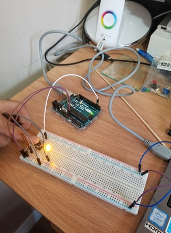

# Talha Amjad's Webpage
<!--
Welcome to your project page for Electronics for the Rest of Us. You'll use this page to describe and showcase your work throughout the module. 
A place for each deliverable has been created below for you in this markdown document. 
Note that comments (such as this) will not appear in the final markdown document (which you can view with the "Preview" button).
-->


## Day 1: Reflection
<!--
In this section, provide a ~250 word reflection on your first day of the module, and discuss why you're interested in this module and what you hope to take away from it.

You're also asked to insert a photo that represents your accomplishments on your first day. 
- Take a photo of you working or one of your circuits and upload it to the /docs/images/ folder of this repository. 
- Then, insert your photo into your document by modifying the markdown example that has been inserted below.
-->
### I was hoping to start working on the boards today. However, the first day of the module was more of an introduction to GitHub and webpages. As a computer science student, I basically use GitHub daily and have created multiple websites in the past. After reading the module outline, I was already expecting the content to be an introduction to GitHub and webpages, so I decided to just work ahead of the class. I took this module hoping to learn a lot about the hardware aspects as I already have a background in programming. I have used languages like Java, python and Haskell and learned how to use GitHub on a more advanced level in my previous year. Furthermore, I have always wanted to program the Arduino boards so I can use it on 3D printed models like small cars or robots. However, I have been so busy with schoolwork that I barely found time to teach myself these skills. As a result, I am excited to work on the Arduino boards because this module will be the start of putting my skills into the hardware side of things. My friends and I have talked about future projects and I hope to have many creative ideas by the end of the module that will need these skills to be used. ###
<!--
Inserting an image takes the form: 

See the following webpage for more information: https://github.com/adam-p/markdown-here/wiki/Markdown-Cheatsheet#images
Replace the elements below to insert your picture.
--> 


## Day 2: Results
<!--
Upload your fully-commented Arduino sketch from your final Day 2 build task--a thermometer connected to an RDB LED--into your GitHub repository.
Provide a short (~150 words) summary of your work on this circuit:
- How does your device work?
- What was challenging? 
- What worked? What didn't? 
- Be sure to link to your code (in your GitHub repository) in the text of your response.
-->
### Once I successfully completed the RGB LED task, I was assigned to use a thermistor to sense the temperature around the room. Using the same setup in the previous task, I used a cable that goes from the 5V socket to one of the positive rails. The RGB LED is then powered by another cable that is plugged from the positive rail to the longest leg of the LED. Furthermore, in order to add the thermistor. I used a cable that goes from the ground socket to the negative rails. Another cable was connected from the negative rail to the resistor. Finally, that resistor connects with a cable that is attached to the analog 0 socket and with a cable connected to the positive rail. From there, I connected the thermistor with the resistor and cable.  The most challenging part of this task was to figure out where the cables went. I had to make sure that the RGB LED was getting power while I was working on the thermistor.  Fortunately, with some challenges, I was able to get everything to work. ###

[ThermistorRGBSketch](https://github.com/inspire-1a03/intersession-2020-Talha2000/blob/master/ThermoRGBSketch.ino/ "ThermistorRGBSketch")

## Arduino build-off results
<!--
Upload your fully-commented Arduino sketch from the final product of your Arduino build-off into the top-level of your module GitHub repository.
In ~300 words, provide a final device description and product pitch: 
- What does it do? Use a table (created in markdown) to list and describe the features. You can use the template provided below. 
- Describe briefly how it works.
- How could it be used in everyday life (or maybe just in rare cases)? 
- Be sure to link to your code (in your GitHub repository) in the text of your response.
- Include a snippet of code using the ``` ``` characters to display the code properly. 
Finally, record a short (30 second) video of a 'product pitch' for your device. 
- Upload the video to Youtube, and use the sample code below to embed your video.
-->


<!--
Below is a general markdown table template. 
You can find more information at these links: 
- https://github.com/adam-p/markdown-here/wiki/Markdown-Cheatsheet#tables

-->

**Features** | **Description** | **Other Notes**
------------ | ------------- | -------------
**Thermistor** | The thermistor is used to check the temperature of the room. In my design, it will be useful for when the temperature is too high | N/A
**Buzzer** | The buzzer will be the "Alarm clock" in this design. When the temperature is too high, it will start buzzing to alert people that there is danger | N/A
**Potentiometer** | The potentiometer will be used as the dial. It changes the loudness or type of tone that goes off. | N/A
**RGB LED** | The RGB LED is used as a way to gain attention. When the temperature is too high, it will flash between red and yellow while also hearing noises from the buzzer until the temperature is back to normal. When the temperature is normal, the color will become blue and the buzzer will stop. | N/A
<!--
Below is an example of embedding a YouTube video in a markdown document for use in GitHub pages. 
Note that this video won't show when previewing the document in GitHub--it only works on the GitHub pages webpage. 
- Once your YouTube video is uploaded, right click and select ```<> Copy embed code```. 
- You can paste this code directly into your markdown document. 
- Note that you may want to adjust the width and height parameters to make it fit well in your webpage
-->

<iframe width="789" height="444" src="https://www.youtube.com/embed/dQw4w9WgXcQ" frameborder="0" allow="accelerometer; autoplay; encrypted-media; gyroscope; picture-in-picture" allowfullscreen></iframe>


## Final reflection & summary
<!--
In ~300 words:
- Summarize your experience in this module. What you learned, what you liked, what you found challenging.
- Reflect upon your learning and its relevance in your life.
-->
